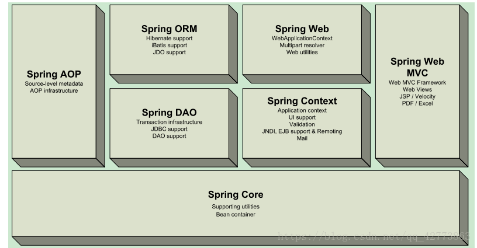

<center> <b> <h1>Spring</h1></b></center>

## 1. 简介

### 1.1 依赖

- SSH: Struct2 + Spring + Hibernate
- SSM: SpringMVC + Spring + MyBatis

加载依赖在pom文件添加Spring WebMVC 即可，其他相关依赖吗 maven 自动加载

```xml
<!-- https://mvnrepository.com/artifact/org.springframework/spring-webmvc -->
<dependency>
    <groupId>org.springframework</groupId>
    <artifactId>spring-webmvc</artifactId>
    <version>5.3.8</version>
</dependency>
<!-- https://mvnrepository.com/artifact/org.springframework/spring-jdbc -->
<dependency>
    <groupId>org.springframework</groupId>
    <artifactId>spring-jdbc</artifactId>
    <version>5.3.8</version>
</dependency>

```

### 1.2 优点

+ Spring 是一个开源免费的框架（容器）
+ Spring 是一个轻量级的，非入侵是架构（引入后不影响原程序使用）
+ 控制翻转（IoC），面向切面编程（AOP）
+ 支持事务处理，对框架整合的支持

总结：Spring是一个轻量级的控制翻转（Ioc）和面向切面编程（AOP）的框架

### 1.3 组成

七大模块



### 1.4 扩展

+ Spring boot 构建一切（Build Anything）
    1. 一个快速开发脚手架
    2. 基于SpringBoot可以快速开发单个微服务
    3. 约定大于配置
+ Spring MVC 协调一切（Coordinate Anything）
+ Spring Cloud 链接一切（Connect Everthing）
    1. SpringCloud 是基于SpringBoot的实现

学习SpringBoot的前提要学习Spring 和 Spring MVC

Spring 弊端，发展太久之后，违背了原来的理念，人称配置地狱

## 2. IoC理论推导

使用new的方式创建对象，用户的需求可能会影响我们原来的代码，我们需要根据用户的需求去修改代码，如果代码两庞大，修改一次成本过于昂贵。


我们使用Set接口实现：

```java
import com.summer.dao.UserDao;

public class UserServiceImpl implements UserService{

    private UserDao userDao;

    public void setUserDao(UserDao userDao){
        this.userDao = userDao;
    }
```

+ 之前程序是主动创建对象，控制权在程序员手上
+ 改为Set注入后，程序不在具有主动性，而是变成被动接受对象

这种思想，从本质上解决了问题，程序员不用再去管理对象的创建了。系统耦合性大大降低，可以更加专注在业务实现，这就是IoC的原型.

**IoC本质**

**控制翻转IoC（Inversion of Control），是一种设计思想，DI（依赖注入）是实现IoC的一种方法 **，没有IoC的程序中，我们使用面向对象编程，对象的创建与对象见的依赖关系完全硬编码在程序中，对象的创建有程序自己控制，控制翻转后将对象的创建转移给第三方，所谓控制反转就是获得依赖对象的方法反转了   

采用xml方式配置bean的时候，bean的定义信息是和实现分离的，而采用注释的方式可以吧两者合为一体，bean的定义信息直接以注释的形式定义在实现勒种，从而达到了零配置的目的  

**控制反转是一种通过描述(XML或注解)并通过第三方产生或获取特定对象的方式，在Spring中实现反转的是IoC容器，其实现方法是依赖注入(Dependency Injection，DI).**  

## 3. IOC创建对象的方式

1. 使用无参构造创建对象，默认模式

2. 使用有参构造创建对象


+ 下标赋值  

```xml
<bean id="user" class="com.summer.pojo.User">
    <constructor-arg index="0" value="Morgen"/>
</bean>
```

+ 类型

``` xml
<bean id="user" class="com.summer.pojo.User">
        <constructor-arg type="java.lang.String" value="Morgen"/>
</bean>
```

+ 参数名

``` xml
<bean id="user" class="com.summer.pojo.User">
        <constructor-arg name="name" value="Gestern"/>
</bean>
```

在配置文件加载的时候，容器中管理的所有的对象就已经创建了。

## 4. 依赖注入

### 4.1 构造其注入

已在上文说明。

### 4.2 Set注入

​	依赖注入

  + 依赖：bean对象的创建依赖于容器
  + 注入 ：bean对象中的所有属性，有容器来注入

【环境搭建】

1. 复杂类型
2. 真实测试对象

### 4.3 拓展方式注入

p 命名空间注入，依据属性注入

+ c命名空间注入，依据有参构造器注入

p-，c-namespace都需要xml引用各自的约束规范才能使用

### 4.4 bean的作用于

| Scope                                                        | Description                                                  |      |
| ------------------------------------------------------------ | ------------------------------------------------------------ | ---- |
| [singleton](https://docs.spring.io/spring-framework/docs/current/reference/html/core.html#beans-factory-scopes-singleton) | (Default) Scopes a single bean definition to a single object instance for each Spring IoC container. |      |
| [prototype](https://docs.spring.io/spring-framework/docs/current/reference/html/core.html#beans-factory-scopes-prototype) | Scopes a single bean definition to any number of object instances. |      |
| [request](https://docs.spring.io/spring-framework/docs/current/reference/html/core.html#beans-factory-scopes-request) | Scopes a single bean definition to the lifecycle of a single HTTP request. That is, each HTTP request has its own instance of a bean created off the back of a single bean definition. Only valid in the context of a web-aware Spring `ApplicationContext`. |      |
| [session](https://docs.spring.io/spring-framework/docs/current/reference/html/core.html#beans-factory-scopes-session) | Scopes a single bean definition to the lifecycle of an HTTP `Session`. Only valid in the context of a web-aware Spring `ApplicationContext`. |      |
| [application](https://docs.spring.io/spring-framework/docs/current/reference/html/core.html#beans-factory-scopes-application) | Scopes a single bean definition to the lifecycle of a `ServletContext`. Only valid in the context of a web-aware Spring `ApplicationContext`. |      |
| [websocket](https://docs.spring.io/spring-framework/docs/current/reference/html/web.html#websocket-stomp-websocket-scope) | Scopes a single bean definition to the lifecycle of a `WebSocket`. Only valid in the context of a web-aware Spring `ApplicationContext`. |      |
|                                                              |                                                              |      |

1. 单了例模式（Spring 默认机制）

```xml
<bean id="accountService" class="com.something.DefaultAccountService"/>

<!-- the following is equivalent, though redundant (singleton scope is the default) -->
<bean id="accountService" class="com.something.DefaultAccountService" scope="singleton"/>
```

2. 原型模式：每次从容器中getBean的时候，都会产生一个新对象

```xml
<bean id="accountService" class="com.something.DefaultAccountService" scope="prototype"/>
```

3. 其余的request，session，application 这些只能在web开发中使用

## 5. Bean的自动装配


自动装配是spring满足bean依赖的一种方式

spring会在上下文中自动寻找，病自动给bean装配属性


spring中有三种装配的方法

1. 在xml中显示的装配
2. 在Java中显示的配置
3. 隐式的自动装配bean【重要】

ByName自动装配

- byname的时候，需要保证所有bean的id唯一，并且这个bean需要和自动注入属性的set方法一致

ByType自动装配

- bytype的时候，需要保证所有bean的class唯一，并且这个bean需要和自动注入的属性类型一致

#### 使用注解实现自动装配

jdk1.5支持注解，spring2.5开始支持注解

The introduction of annotation-based configuration raised the question of whether this approach is “better” than XML. 

使用注解须知：

1. 导入约束：context约束
2. 配置注解的支持：<context:annotation-config/>

```xml
<?xml version="1.0" encoding="UTF-8"?>
<beans xmlns="http://www.springframework.org/schema/beans"
    xmlns:xsi="http://www.w3.org/2001/XMLSchema-instance"
    xmlns:context="http://www.springframework.org/schema/context"
    xsi:schemaLocation="http://www.springframework.org/schema/beans
        https://www.springframework.org/schema/beans/spring-beans.xsd
        http://www.springframework.org/schema/context
        https://www.springframework.org/schema/context/spring-context.xsd">

    <context:annotation-config/>

</beans>
```

@Autowired

直接在属性上使用即可，也可以在set方法上使用

使用autowired我们可以不用编写set方法，前提是你要在这个装配的属性在IOC容器中存在，且符合名字byname.

如果@Autowired自动装配的环境比较复杂，自动装配无法通过一个注解【@Autowired】完成的时候，我们可以使用@Qualifier（value="xxx"）去配置@Autowired的使用，指定一个唯一的bean注入

小结

@Resource和@Autowired的区别：

- 都是用来自动装配的，都可以放在属性字段上
- @Autowired通过ByType的方式实现，而且必须要求这个对象的存在
- @Resource通过ByName的方式实现，如果找不到名字，则通过ByType实现，如果两个都找不到，就报错
- 执行顺序不同：@Autowired通过ByType的方式实现。@Resource默认通过ByName的方式实现

## 6. 使用注释开发

在spring4之后，要使用注解开发，必须保证aop的包和xml配置文件需要导入context约束

@Component加在类上，表示注册该类给容器托管，使用@value进行属性注入

衍生的注解

​	@Component有几个衍生注解，mvc三层架构分解

- dao @Repository
- service @Service
- controller @Controller

这四个注解功能都是一样的，都是代表将某个类注册到spring中，装配Bean

自动装配

``` txt
@Aurowird 自动装配通过类型、名字
		如果Autowired不能唯一装配上属性，则需要通过@Qualifier（value="xxx"）
@Nullable 字段表设这个注解，说明这个字段可以为null
@Resource 自动装配通过名字，类型
```

作用域

@Scope("prototype") 原型模式，默认为单例模式

小结

xml与注解

- xml更加万能，使用与任何场合，维护简单方便
- 注解不是自己类使用不了，维护相对复杂

xml与注解最佳实践

- xml用来管理bean
- 注解只负责完成属性注入
- 我们在使用的过程中只要注意一个问题，需要开启注解的支持

``` xml
<!--指定要扫描的包，这个包下的注解就会生效-->
<context:component-scan base-package="com.summer"/>
<context:annotation-config/>
```

## 7. 代理模式

为什么要学习代理模式？因为这就是SpringAOP的底层【SpringAOP和SpringMVC】

代理模式分类

- 静态代理
- 动态代理

### 7.1静态代理

角色分析：

- 抽象角色：一般使用接口或抽象类解决
- 真实角色：被代理的角色
- 代理角色：代理真实角色，代理真实角色后，我们会做一些附属操作
- 客户：访问代理对象得人

代理模式的好处

- 可以使真实角色操作更加纯粹，不用去关注一些公共的业务
- 公共业务就交给代理角色，实现业务的分工
- 公共业务发生扩展的时候，方便集中管理

缺点：

- 一个真实角色就会产生一个代理角色，代码量会翻倍开发效率会变低

### 7.2 加深理解

### 7.3 动态代理

- 动态代理和静态代理角色一样
- 动态代理的代理类是动态生成的，不是我们写好的
- 动态代理两大类：基于接口的动态代理，基于类的动态代理
  + 基于接口----JDK动态代理
  + 基于类：cglib
  + java字节码实现：javassist

需要了解两个类：Proxy，InvocationHandler

动态代理的好出：

- 可以使真实角色操作更加纯粹，不用去关注一些公共的业务
- 公共业务就交给代理角色，实现业务的分工
- 公共业务发生扩展的时候，方便集中管理

缺点：

- 一个动态代理类代理的是一个接口，一般就是对应的一类业务
- 一个动态代理可以代理多个类，只要是实现了同一个接口

## 8. AOP

提供声明式事务，允许用户自定义切面

+ 横切关注点：跨越应用程序多个模块的方法或功能，即与我们业务无关但我们需要关注的部分，比如日志，缓存
+ 切面（Aspect）：横切关注点被模块化的特殊对象，是一个类
+ 通知（Advice）：切面完成的工作，勒种的一个方法
+ 目标（Target）：被通知对象
+ 代理（Proxy）：向目标对象应用通知之后创建的对象
+ 切入点（Cutpoint）：切面通知执行的地点的定义
+ 连接点（JointPoint）：与切入点匹配的执行点

8.1 使用Spring实现Aop

使用AOP织人，需要导入一个依赖包

```xml
<!-- https://mvnrepository.com/artifact/org.aspectj/aspectjweaver -->
        <dependency>
            <groupId>org.aspectj</groupId>
            <artifactId>aspectjweaver</artifactId>
            <version>1.9.6</version>
        </dependency>
```


方法1：使用Spring的API接口[主要Spring API接口实现]

方法2：使用自定义实现AOP[主要是切面定义]

方法3：使用注解实现

## 9. 整合MyBatis

步骤：

1. 导入jar包
   + junit
   + mybatis
   + mysql数据库
   + spring相关
   + aop织入
   + mybatis-spring
2. 编写配置文件
3. 测试

### 9.1 回忆mybatis

1. 编写实体类
2. 编写核心配置文件
3. 编写接口
4. 编写Mapper.xml
5. 测试

### 9.2 MyBatis-Spring

1. 编写数据源

``` xml
<!--Datasource 使用spring的数据源替换MyBatis的配置 c3p dbcp druid
    这里使用Spring提供的JDBC-->
    <bean id="datasource" class="org.springframework.jdbc.datasource.DriverManagerDataSource">
        <property name="driverClassName" value="com.mysql.cj.jdbc.Driver"/>
        <property name="url" value="jdbc:mysql://localhost:3307/savi-sys?useSSL=true&amp;useUnicode=true&amp;characterEncoding=utf8"/>
        <property name="username" value="root"/>
        <property name="password" value="1234"/>
    </bean>
```


2. sqlSessionFactory

``` xml
    <!--sqlSessionFactory-->
    <bean id="sqlSessionFactory" class="org.mybatis.spring.SqlSessionFactoryBean">
        <property name="dataSource" ref="datasource"/>
        <!--绑定配置文件-->
        <property name="configLocation" value="classpath:mybatis-config.xml"/>
        <property name="mapperLocations" value="classpath:/com/summer/mapper/*.xml"/>
    </bean>
```


3. sqlSessionTemplate

   ``` xml
   <!--SqlSessionTemplate就是我们使用的sqlSession-->
       <bean id="sqlSession" class="org.mybatis.spring.SqlSessionTemplate">
           <!--只能使用构造器注入，因为没有set方法-->
           <constructor-arg index="0" ref="sqlSessionFactory"/>
       </bean>
   ```

   

4. 需要给接口加实现类

   ``` java
   public class UserMapperImpl implements UserMapper{
   
       //我们所有操作都使用sqlSessionTemplate来执行
       private SqlSessionTemplate sqlSessionTemplate;
   
       public void setSqlSessionTemplate(SqlSessionTemplate sqlSessionTemplate) {
           this.sqlSessionTemplate = sqlSessionTemplate;
       }
   
       @Override
       public List<User> selectUser() {
           UserMapper mapper = sqlSessionTemplate.getMapper(UserMapper.class);
           return mapper.selectUser();
       }
   }
   ```

   

5. 注册实现类

   ``` xml
   <bean id="userMapper" class="com.summer.mapper.UserMapperImpl">
           <property name="sqlSessionTemplate" ref="sqlSession"/>
       </bean>
   ```

6. 测试

   ``` java
   @Test
       public void test2(){
           ApplicationContext context = new ClassPathXmlApplicationContext("spring-dao.xml");
           UserMapperImpl bean = context.getBean(UserMapperImpl.class);
           bean.selectUser().forEach(user -> {
               System.out.println(user);
           });
   
       }
   ```

   

## 10. 声明式事务

1、回顾事务

+ 一组业务当成一个业务来做，要么都成功要么都失败
+ 事务在项目开发中，十分重要，涉及到数据的一致性
+ 确保一致性和完整性

2、Spring中的事务管理

+ 声明式事务：AOP
+ 编程式事务：需要在代码中进行服务的管理

> 思考：为什么需要事务

+ 如果不配置事务，可能出现数据提交不一致的情况
+ 如果不在Spring中配置声明式事务，就需要在代码中手动配置事务
+ 事务在项目的开发中十分重要， 确保数据的一致性和完整性

> 事务传播特性

1. PROPAGATION_REQUIRED：支持当前事务，如果当前没有事务，就新建一个事务。这是最常见的选择。

2. PROPAGATION_SUPPORTS：支持当前事务，如果当前没有事务，就以非事务方式执行。

3.     PROPAGATION_MANDATORY：支持当前事务，如果当前没有事务，就抛出异常。

4.     PROPAGATION_REQUIRES_NEW：新建事务，如果当前存在事务，把当前事务挂起。

5.     PROPAGATION_NOT_SUPPORTED：以非事务方式执行操作，如果当前存在事务，就把当前事务挂起。

6.     PROPAGATION_NEVER：以非事务方式执行，如果当前存在事务，则抛出异常。

7.     PROPAGATION_NESTED：支持当前事务，新增Savepoint点，与当前事务同步提交或回滚。

